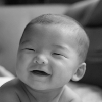

# Graph Laplacian Image Deblurring

Python implementation of image deblurring with graph-Laplacian regularization.

Originally developed for a mathematical image analysis project and later revised into a cleaner GitHub implementation.

## Overview

This project constructs a blurred/noisy observation from a grayscale image and restores the image by solving a regularized inverse problem with a sparse weighted graph Laplacian and conjugate gradient.

## Results

The method improves the PSNR from **38.4841 dB** for the blurred/noisy image to **42.4316 dB** for the restored image.

| Original | Blurred / Noisy | Restored |
|---|---|---|
|  |  |  |

## Method

Let $x$ be the unknown clean image, $A$ be a Gaussian blur operator, and $b^\delta$ be the blurred/noisy observation:

$$
b^\delta = A x_{\mathrm{true}} + \eta .
$$

The restoration is computed by solving

$$
\min_x \lVert Ax - b^\delta \rVert_2^2 + \mu x^T L x,
$$

where $L$ is a weighted graph Laplacian built from the observed blurred/noisy image. The normal equation is

$$
(A^T A + \mu L)x = A^T b^\delta .
$$

Pixels are treated as graph vertices with 4-neighbor edges. The edge weights are

```math
w_{ij} = \exp\left(-\frac{(y_i-y_j)^2}{\theta}\right),
```

where `y` is a smoothed version of the observed image. Similar neighboring pixels receive larger weights, while sharp intensity changes receive smaller weights.

## Repository structure

```text
graph-laplacian-image-deblurring/
├── README.md
├── requirements.txt
├── src/
│   └── deblur_graph_laplacian.py
├── data/
│   └── .gitkeep
└── results/
    └── .gitkeep
```

## Installation

```bash
python3 -m venv .venv
source .venv/bin/activate
pip install -r requirements.txt
```

## Usage

Put an input image at:

```text
data/image-Dante.png
```

Then run:

```bash
python src/deblur_graph_laplacian.py --image data/image-Dante.png --outdir results/dante_v1
```

The script saves:

```text
results/dante_v1/original.png
results/dante_v1/blurred_noisy.png
results/dante_v1/restored.png
results/dante_v1/comparison.png
results/dante_v1/metrics.txt
```

You can also tune the parameters:

```bash
python src/deblur_graph_laplacian.py \
  --image data/image-Dante.png \
  --outdir results/dante_v1 \
  --factor 2 \
  --blur-size 5 \
  --blur-sigma 1.0 \
  --noise-level 0.005 \
  --mu 0.1 \
  --theta 0.01
```

## Notes

- `mu` controls the strength of graph-Laplacian regularization.
- `theta` controls how sensitive graph weights are to intensity differences.
- The graph Laplacian is built from the observed blurred/noisy image, not from the clean ground-truth image.
- For a portfolio V1, commit the source code, README, requirements file, and one representative output figure if you have the right to share the input image.

## Possible V2 improvements

- Add comparison with Tikhonov/TV regularization.
- Add a parameter sweep over `mu` and `theta`.
- Add SSIM in addition to PSNR.
- Support color images channel-by-channel.
- Replace the 4-neighbor graph with a patch-based graph.
